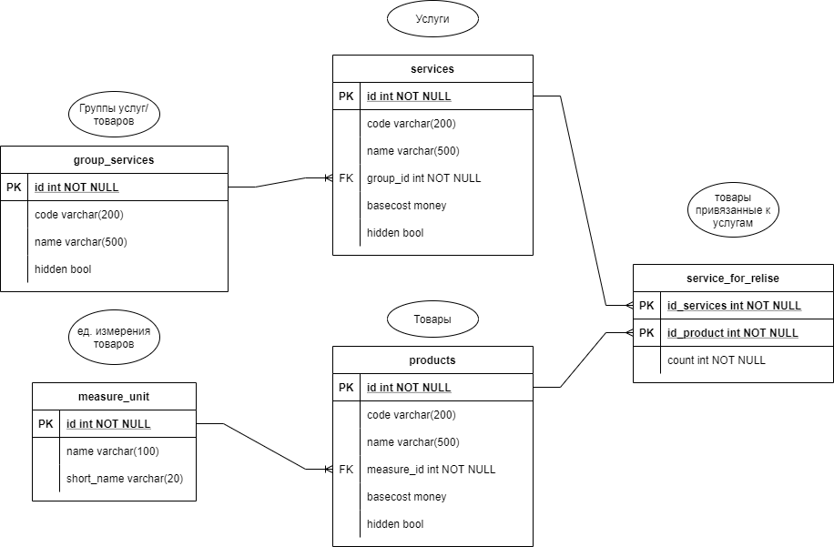

# GoDBProject

Учебный проект, реализующий взаимодействие с БД.
Пользователь получает возможность взаимодействия с данными через REST API. 

## ER-Диаграмма базы данных

*ER-Диаграмма*


## Документация
Доступное REST API:
- GET localhost:80/all-price (Возвращает прайс-лист) JSON
- GET localhost:80/service/{id}/material-details (Возвращает материальную детализацию сервиса) JSON
- POST localhost:80/insert-product-to-service (Записывает товар к услуге) JSON на вход с параметрами (Product, Service, Count):
``` 
{
    "Product": 2,
    "Service": 2,
    "Count": 7
}
```
- PUT localhost:80/update-service-price (Обновляет стоимость работу услуги) На вход JSON (Id, Basecost)
- PUT localhost:80/update-product-price (Обновляет стоимость товара) На вход JSON (Id, Basecost)
```
{
  "Id": 1,
  "Basecost": 142.20
}
```
- PUT localhost:80/update-service-hidden (Обновляет стоимость товара) На вход JSON (Id, Hidden)
- PUT localhost:80/update-product-hidden (Обновляет стоимость товара) На вход JSON (Id, Hidden)
- PUT localhost:80/update-service-group-hidden (Обновляет стоимость товара) На вход JSON (Id, Hidden)
```
{
  "Id": 1,
  "Hidden": true
}
```
- DELETE localhost:80/service (Обновляет стоимость товара) На вход JSON (Id)
```
{
  "Id": 1,
}
```
